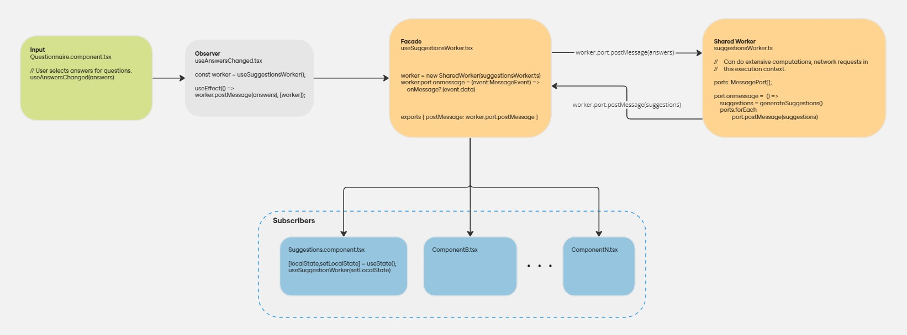

# React Shared Worker Demo

[Working example](https://emredenizx.github.io/react-shared-worker-demo/)

### Overview

JavaScript is inherently single-threaded, meaning it executes code sequentially, one operation at a time. This can lead to performance bottlenecks, particularly when executing long-running tasks like extensive computations or processing responses from frequent API calls. To overcome this limitation, [Web Workers](https://developer.mozilla.org/en-US/docs/Web/API/Web_Workers_API/Using_web_workers) provide a way to run scripts in background threads, allowing the main thread to remain responsive.

This project is a demonstration of the use of [SharedWorker](https://developer.mozilla.org/en-US/docs/Web/API/SharedWorker) in a react application. Unlike dedicated workers, shared workers can be accessed by multiple scripts running in different windows, tabs, or iframes, making them ideal for scenarios where shared state or functionality is needed across different parts of an application.

### Story

In a previous project, I worked on an application where a typical patient examination involved a series of questions. Based on the answers provided, the application would generate suggestions for diagnoses, treatments, or medications as autocomplete options. To improve the user experience, real-time suggestions were required to be displayed as the page data frequently changed without causing delays or blocking the UI.

### Solution

A shared worker can be used to process the input and generate the required suggestions in the background and allowing multiple components to subscribe to these updates. This approach can significantly improve the performance by offloading the computation to a separate thread, ensuring that the main thread remains responsive to user interactions.

### The Flow

1. **Input:** The page collects answers to questions about the patient.
2. **Observer:** The hook listens for changes in the answers and posts message with the page data to the worker.
3. **Facade:** The hook exposes a simple API and manages the communication with the worker.
4. **Shared Worker:** The worker processes the data, abstracting generation of suggestions, and broadcasts the results to all connected ports.
5. **Subscribers:** Multiple components can receive and utilize the suggestions, allowing for efficient data sharing across the application.

### Conclusion

Shared web workers help maintain a responsive user interface, even when handling intensive operations and sharing data across multiple components. By offloading the computation to a separate thread, the main thread remains free to handle user interactions, ensuring a smooth and uninterrupted experience. This approach can be particularly useful in applications that require real-time updates.
